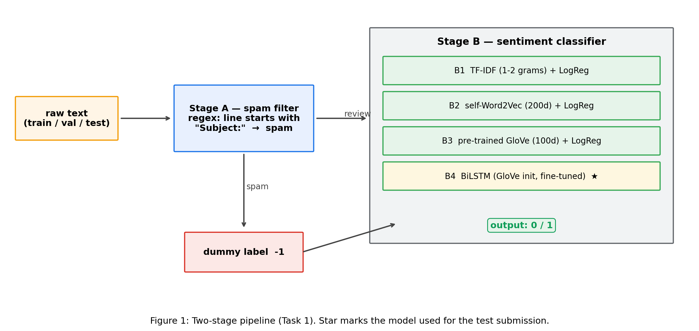
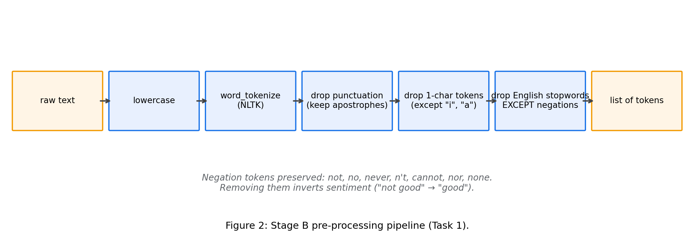
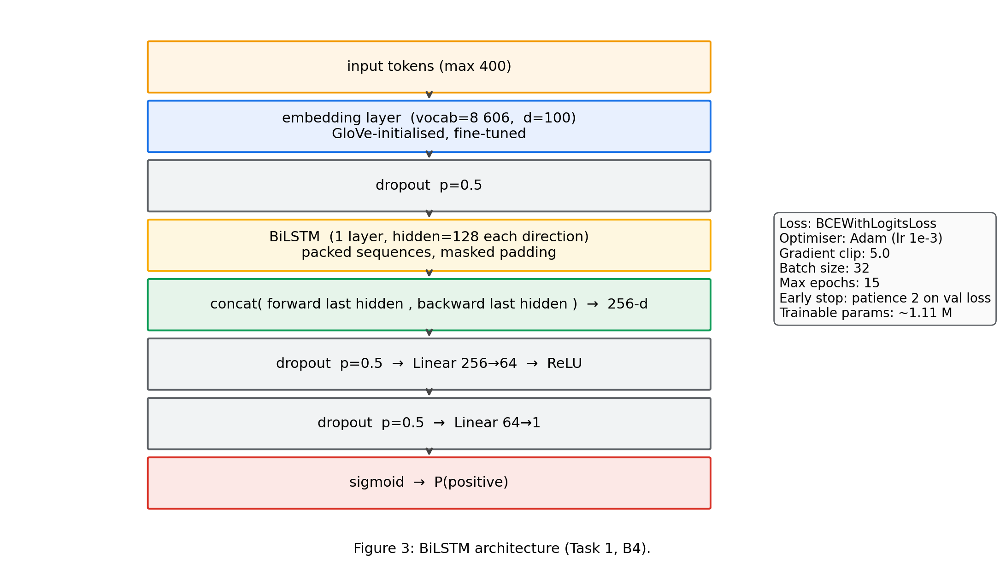

 

# Task 1 Sentiment Analysis

## 1. Problem and design

The given data contain a mixture of movie reviews and email style spam. Spam data was given random binary labels, which means the `label` column does not provide useful information for those rows. Ised one supervised classifier for all three groups, it would create a flawed decision boundary. When data is checked, found that every spam row came from corporate emails, each starting with a `Subject:` header on the first line. This structure does not appear in movie reviews. A two stage pipeline was therefore adopted (Figure 1) Stage B is trained only on rows that Stage A flags as real reviews. Spam rows in the test output receive the dummy label `-1`.



*Figure 1: Two stage pipeline. Spam rows bypass the sentiment classifier and receive the dummy label `-1`. The four Stage B approaches share Stage A, the star marks B4 (BiLSTM), used for the test set submission.*

## 2. Data inspection

Splits are 11,503 rows train, 1,397 rows val, 1,434 row test with a nearly balanced binary `label`. A regex frequency scan over email content patterns showed that **`Subject:` line starts occur with similar frequency in label 0 and label 1** (means 0.45 vs 0.44 per row): the predicted signature of an email population distributed evenly across the two sentiment classes. URL and e-mail address features are essentially zero, indicating Enron style operational correspondence rather than promotional link spam.

## 3. Stage A approaches compared

Two approaches were compared.

**A1 Heuristic (Subject line rule).** A regex flags rows whose first non whitespace characters match `subject\s*:` (case insensitive). Zero learnable parameters encodes the structural signature.

**A2 TF IDF + Logistic Regression with weak labels.** The output from A1 on the training set serves as a weak target. Texts are vectorised via TF IDF (scikit learn [1]; word 1-2 grams, `min_df=3`, `max_df=0.95`, sublinear TF, lowercase, accent stripping). Logistic regression (binary cross entropy, L2, `C=1.0`, `max_iter=2000`) fits these labels. Intent: generalise beyond the literal regex by learning broader email style vocabulary. `min_df`/`max_df` filter rare and near stopword terms; sublinear TF dampens repetition; bigrams catch short email cues; `C=1.0` keeps the weak label signal from being washed out.

**Hand labelled oracles.** Since the supplied data did not include spam labels, I manually annotated 100 training rows and 100 validation rows using seed 42. Train: 75 reviews  25 spam, val: 84 / 16. These 200 rows are the only ground truth spam labels in this project.

## 4. Metrics

For a binary problem with positive class **P** and predicted positive set **Q**:

 **Accuracy** = (TP + TN) / N. Sets are class balanced after Stage A filtering.
 **Precision** = TP / |Q|; **Recall** = TP / |P|; **F1** their harmonic mean.
 **Confusion matrix**: rows = true, cols = predicted, absolute counts.

For the end to end pipeline a 3 class confusion matrix over {spam dummy, negative, positive} is reported.

## 5. Stage A results

Both approaches achieve perfect classification on both oracles:

| Set | Rows | A1 acc | A2 acc | Confusion (rows=true, cols=pred) |
|---|---:|---:|---:|---|
| Train oracle | 100 | 1.000 | 1.000 | `[[75, 0], [0, 25]]` |
| Validation oracle | 100 | 1.000 | 1.000 | `[[84, 0], [0, 16]]` |

A1 and A2 disagree on 33 of 11,503 training rows (short Enron emails where A2 scores 0.2–0.5, below threshold); A2 never flags any row A1 missed. Predicted spam fractions of 25.6% / 23.3% / 24.9% match the brief's "even distribution" claim. **A1 is used in production**: more conservative, no training, fully interpretable, zero false positives on 2,000 NLTK movie reviews (§9). With 0/200 oracle errors, the 95% upper bound on Stage A error rate is ≈1.5%.

## 6. Stage B pre processing

A single tokeniser is applied identically to the AML training, validation, test, and NLTK external corpus (rule: pre processing must mirror across all evaluation sets), shown in Figure 2.



*Figure 2: Stage B pre processing pipeline. Negation tokens (`not`, `no`, `never`, `n't`, `cannot`, `nor`, `none`) are explicitly preserved because removing them inverts sentiment ("not good" → "good").*

## 7. Stage B approaches compared

Four approaches with progressively richer representations were compared. All use binary cross entropy loss; the linear models use it via logistic regression, the BiLSTM via `BCEWithLogitsLoss`.

**B1 TF IDF (1-2 grams) + Logistic Regression.** Same vectoriser settings as A2 but driven by the sentiment `label` of non spam training rows.

**B2 Self trained Word2Vec + Logistic Regression.** 200d CBOW model (gensim [5]; window=5, min_count=3, 10 epochs) trained on cleaned training reviews. Each review is the mean of its in vocabulary vectors.

**B3 Pre trained GloVe (100d, 6B token Wikipedia + Gigaword) + Logistic Regression.** Same averaging strategy as B2 with `glove-wiki-gigaword-100` [6]. Pre training is unsupervised (co occurrence factorisation, no labels) satisfies the rule against external labelled data.

**B4 BiLSTM with GloVe initialisation, fine tuned (PyTorch [7]).** Architecture in Figure 3. Adam (`lr=1e-3`), grad clip 5.0, batch 32, max 15 epochs, early stopping on val loss (patience 2). GloVe vocabulary coverage 96.2% (8,278 / 8,606); OOV tokens Gaussian initialised and updated during fine tuning. Early stopping triggered at epoch 5; best epoch (3) restored before evaluation.



*Figure 3: B4 BiLSTM architecture. Bidirectionality captures constructions like "good ... but boring" where sentiment depends on what comes after a positive word. Trained with `BCEWithLogitsLoss`.*

## 8. Stage B results

Quantitative results on the **held out validation set** (1,066 reviews after Stage A filtering, perfectly balanced 533 / 533):

| Model | Accuracy | Precision | Recall | F1 |
|---|---:|---:|---:|---:|
| B1 TF IDF | 0.760 | 0.771 | 0.739 | 0.755 |
| B2 self W2V | 0.568 | 0.558 | 0.653 | 0.602 |
| B3 GloVe | 0.720 | 0.722 | 0.717 | 0.719 |
| **B4 BiLSTM** | **0.775** | 0.762 | **0.799** | **0.780** |

Confusion matrix for B4 (rows = true, cols = predicted, classes `[0, 1]`):
```
[[400, 133],
 [107, 426]]
```

**Observations.** B2 underperforms 8,530 short reviews is too small to learn dense vectors; B3 recovers most of the gap by importing 6 B token statistics. B1 beats B3 because bigram TF IDF captures explicit phrases ("not good", "very bad") that LogReg can weight directly, whereas dense averaging discards order. B4 beats B1 because its sequence model preserves order and bidirectional context; higher recall (0.799 vs 0.739) suggests it captures positive markers buried late in reviews.

**End to end 3 class confusion matrix on the validation oracle** (true class from hand labelling for spam rows, otherwise the supplied `label`):

```
           pred=spam  pred=neg  pred=pos
true spam       16         0          0
true neg         0        31          9
true pos         0         9         35
```

3 class accuracy 82.0%. Stage A precision and recall both 1.0; Stage B review accuracy 78.6% (66/84), stable against 77.5% on the full filtered validation set.