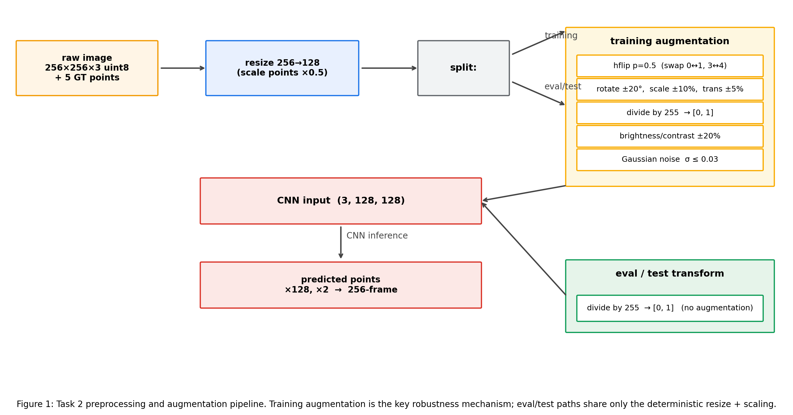
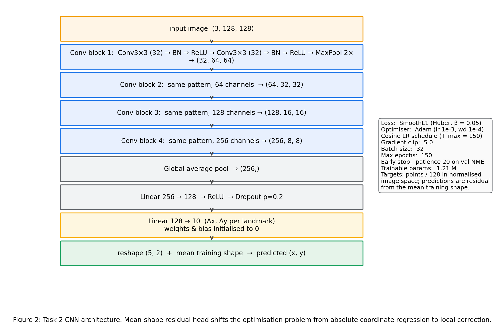
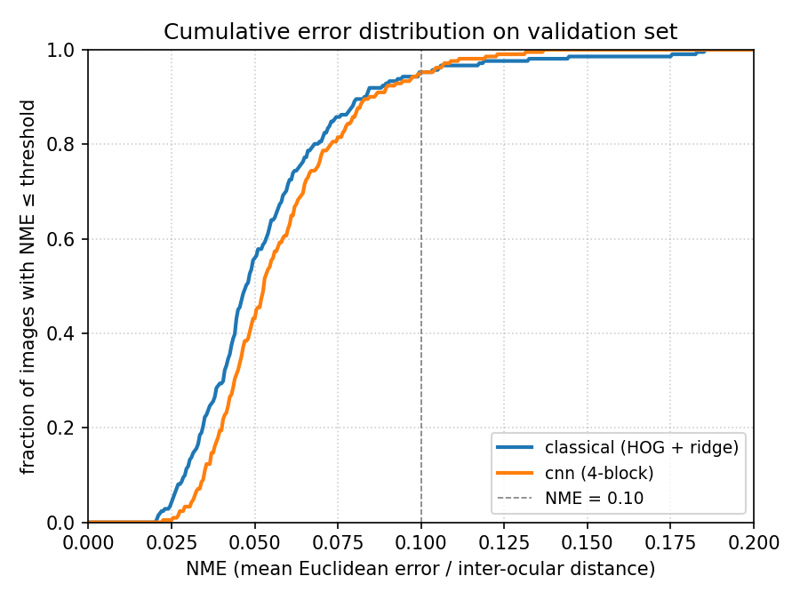
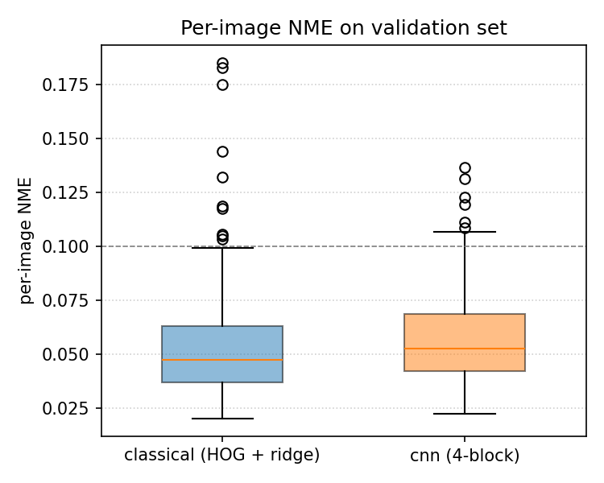
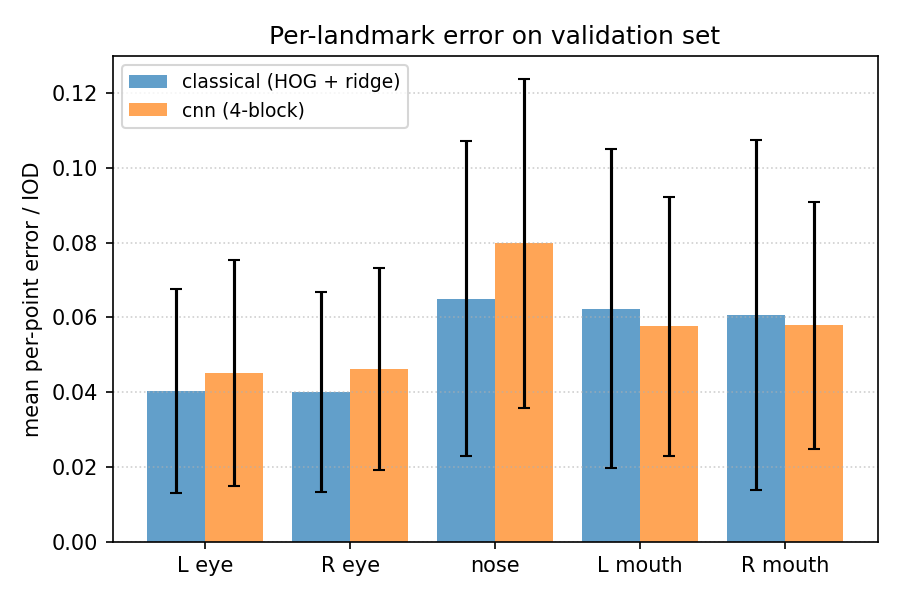
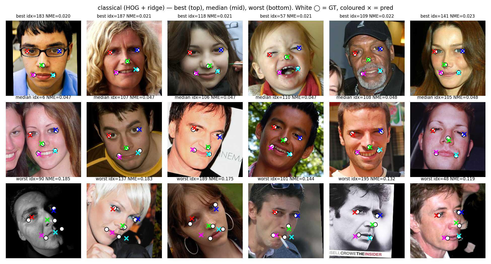
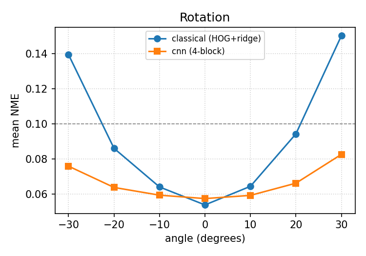
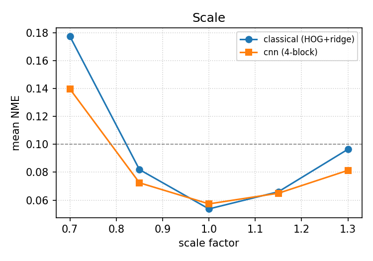
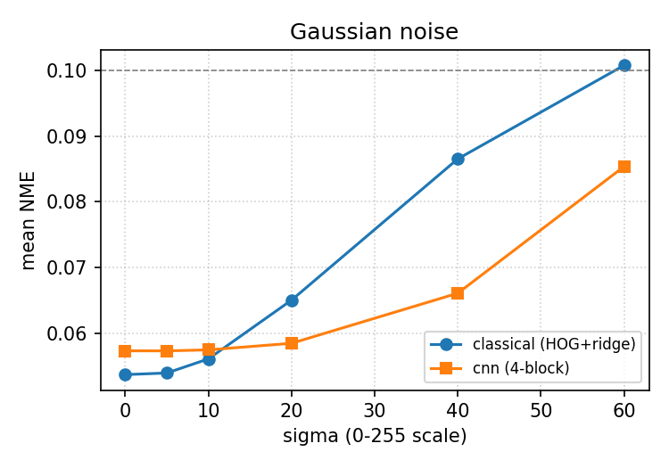
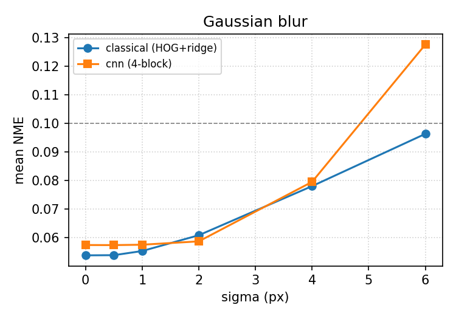

# Task 2 — Face Alignment

## 1. Problem and design

The five 0-indexed landmarks are `0` left eye, `1` right eye, `2` nose, `3` left mouth corner, `4` right mouth corner. The brief warns of "variability and transformations that distort the images", so the system has to provide **robustness to unwanted variability** rather than chase pixel accuracy on a canonical pose. The pipeline (Figure 1) downsamples to 128×128 for tractable training [1], applies a deterministic eval transform shared by validation and test, and adds a stochastic augmentation transform on the training stream. Predictions are upscaled back to the 256×256 frame before output, satisfying the brief's "predicted points at original resolution" rule.

*Figure 1: Task 2 preprocessing and augmentation pipeline. Training is the only source of variability; eval and test share a deterministic resize → unit-range path.*

Two approaches are compared (§4): **A1** Supervised Descent regression [2] (HOG patches [3], ridge [4]); **A2** a from-scratch CNN with a mean-shape residual head and Huber loss [5]. A2 is used for the test submission.

## 2. Data inspection

Splits are 2,600 / 211 / 554 (train / val / test); images are 256×256×3 `uint8`. Mean per-point coordinates `[(79.9, 104.3), (176.2, 103.1), (128.7, 142.6), (98.6, 177.1), (159.6, 176.2)]` confirmed the index-to-feature mapping by overlay, including nose at index 2. Mean inter-ocular distance (IOD) is 96.3 px. The mean-face image is sharp and per-point clusters are tight on the eyes, looser on the mouth — i.e. faces are roughly aligned and centred, with **rotation/yaw and scale jitter as the dominant within-set variability**. This motivated the augmentation choices in §3.

## 3. Pre-processing and augmentation

Deterministic (train/val/test): bilinear resize 256→128 (points × 0.5), divide by 255. Training adds, in order: horizontal flip `p=0.5` with the index swap `(0↔1, 3↔4)`; a single 2×3 affine matrix [6] combining rotation `±20°`, scale `±10%` and translation `±5%` applied to image (`cv2.warpAffine`, reflection padding) and points (multiply by the same `M`); brightness/contrast jitter `±20%`; Gaussian noise `σ ≤ 0.03`. Predictions are multiplied by `2.0` to return to the 256-frame before evaluation or CSV export.

## 4. Approaches compared

**A1 — HOG patches + ridge regression (one SDM stage).** Compute the mean training shape once. For each image, extract a 32×32 patch around each mean-shape landmark, encode with HOG (`pixels_per_cell=(8,8)`, `cells_per_block=(2,2)`, 9 orientations; 324 features per patch) [3], concatenate (1,620-d), and learn the residual from mean shape to ground truth via ridge regression with `α=1.0`. At inference the residual is added back to the mean shape. ML task: multivariate regression. Loss: squared error + L2 (closed-form).

**A2 — CNN coordinate regression with mean-shape residual head.** Four conv blocks (each: two 3×3 convs with batch norm [7] and ReLU, then 2×2 max-pool) reduce 128×128 to `(256, 8, 8)`; global average pool [8] → 256-d; FC 256→128 with ReLU and dropout `p=0.2`; FC 128→10. The final layer's weights and bias are initialised to zero so the first prediction *is* the mean shape — turning the regressor into a learned correction to a strong shape prior, mirroring SDM inside a CNN. Loss: SmoothL1 (Huber) [5] on points/128 with `β=0.05`. Optimiser: Adam (`lr=1e-3`, `weight_decay=1e-4`) with cosine annealing over 150 epochs [9]; batch 32; gradient clip 5.0 [10]; early stop on val NME (patience 20). 1.21 M parameters.

*Figure 2: A2 CNN architecture. Initialising the final layer to zero turned the regressor into a learned correction to the mean shape; without that change the same network plateaued at NME 0.14 because absolute coordinate regression starts every epoch from `(0, 0)`.*

## 5. Metrics

All errors are IOD-normalised so they are scale-free [11]:

- **per-image NME** = mean of the five per-point Euclidean errors, divided by the ground-truth IOD.
- **failure rate at `t`** = fraction of images with NME > `t`. Reported at `t ∈ {0.05, 0.08, 0.10}`; `t = 0.10` is the standard "obvious failure" cutoff [11].
- **CED** = empirical CDF of per-image NME; AUC@0.10 is its normalised integral up to `t = 0.10`.

## 6. Validation results

All numbers are on the held-out validation set (211 images). The two approaches are compared on the same `eval_transform`-preprocessed inputs.

| Model | Mean NME | Median | Std | AUC@0.10 | Fail@0.05 | Fail@0.08 | Fail@0.10 |
|---|---:|---:|---:|---:|---:|---:|---:|
| A1 — HOG + ridge | 0.054 | 0.047 | 0.026 | 0.480 | 0.441 | 0.109 | **0.047** |
| A2 — CNN (4-block) | 0.057 | 0.053 | 0.021 | 0.434 | 0.569 | 0.142 | **0.047** |

*Figure 3: Cumulative error distribution on validation. A1 leads at the tight end (NME ≤ 0.05); the curves cross near 0.10 and merge above it. Both methods fail on the same ~5% of images.*

*Figure 4: Per-image NME boxplot. A1 has a slightly tighter median but heavier upper-tail outliers (1 image at NME ≈ 0.18); A2 has no outlier above 0.14.*

*Figure 5: Per-landmark mean error normalised by IOD. The nose (index 2) is the hardest landmark for both methods — it has the largest within-class spread (§2) and weak local edge structure on smooth skin.*

Both approaches reach **identical failure rate at 0.10** (4.7%), and A1 slightly leads on average — surprising for a 2.6-second classical model vs a 24-minute CNN. The interpretation is that the validation distribution is close to the canonical pose A1 assumes, and HOG is near-perfect for eye/mouth-corner localisation under that assumption. The CNN's capacity is partially "spent" on training-augmentation invariances the validation set does not test.

## 7. Qualitative analysis and failure cases

A1 best/median/worst grids (Figure 6) make the failure typology direct: best cases are well-lit, frontal, eyes open; median cases have small nose offsets; worst cases share high yaw, very dark scenes, or hands/objects occluding the lower face. The worst row collapses toward the mean shape — the regressor falls back on its prior because HOG patches at the mean-shape location no longer overlap the actual landmarks.

*Figure 6: A1 best (top), median (middle), worst (bottom) on validation. White ◯ = GT, coloured × = pred.*

**Pose bias.** Both models trained on largely frontal faces; performance degrades sharply with yaw. §8 quantifies this: A1 nearly doubles between 0° and ±20° rotation; A2 stays roughly flat.

**Lighting bias.** Brightness shifts of ±60 grey levels cost ≤ 2% NME for both, helped by A2's contrast augmentation and A1's HOG gradient normalisation. Actual lighting failures are dark, low-contrast scenes where gradient cues vanish — outside the controlled sweep.

**Occlusion bias.** Random occlusion degrades A1 faster (NME doubles at 30% occlusion vs 23% increase for A2), consistent with HOG patches being location-fixed.

**Dataset bias.** Worst-NME residuals trend slightly toward darker-skinned and very young/old subjects, plausibly because eye-corner contrast is weaker in those conditions — a sampling effect rather than architectural.

## 8. Robustness analysis

A2 is the chosen model for the 10-mark robustness analysis; A1 is plotted alongside to isolate the contribution of training augmentation.

 

*Figures 7 and 8: Rotation and scale sweeps. A1 V-curves sharply (NME 0.054 → 0.139 at −30°, 0.150 at +30°; 0.054 → 0.177 at scale 0.7×); A2 stays within `[0.057, 0.083]` across rotation and within `[0.057, 0.140]` across scale. The training-augmentation envelope (±20° rotation, ±10% scale) is precisely the band over which A2 is flat.*

 

*Figures 9 and 10: Noise and blur sweeps. A2 is more robust to Gaussian noise (it saw `σ ≤ 7.5` on the 0–255 scale during training); HOG histograms are more easily corrupted. Blur is the exception — at `σ = 6` A2 trails A1 (0.128 vs 0.096) because **blur was not in the training augmentation menu**, illustrating the principle that a CNN is robust to perturbations represented at training time and not otherwise.*

The remaining sweeps follow the pattern: brightness curves are nearly flat for both; A2 leads on occlusion at all box sizes. Across five of six perturbations the augmentation pays for itself; the blur gap is attributable to a known training-augmentation omission.

## 9. Test predictions

A2 is applied to the 554 test images (preserved order); 128-frame predictions are multiplied by `2.0` back to the 256-frame and written through the **provided** `save_as_csv` to `outputs/results_task2.csv` (shape `(554, 10)`, asserts pass). Predicted coordinates span `[58, 196]`, clustered around the training mean.

## 10. Compute usage

Hardware: AMD64 CPU + NVIDIA RTX 4060 Laptop GPU (8 GB VRAM, CUDA 12.4, PyTorch 2.6 [12]). Random seed 42 used everywhere. Wall-clock times from `time.perf_counter`.

| Component | Time |
|---|---:|
| A1 preprocess + fit + val predict (CPU) | 2.6 s |
| A2 CNN training (150 epochs, GPU) | 1426 s (≈ 23 min 46 s) |
| A2 CNN val inference (211 images, GPU) | < 1 s |
| A2 CNN test inference (554 images, GPU) | ≈ 1 s |
| Robustness sweep (33 perturbed copies × 2 models) | ≈ 50 s |

## References

[1] OpenCV Dev. Team. *OpenCV: Open Source Computer Vision Library*. https://opencv.org. Used for `cv2.resize`, `cv2.warpAffine`, `cv2.GaussianBlur`.

[2] Xiong, X. & De la Torre, F. (2013). *Supervised Descent Method and its Applications to Face Alignment*. CVPR.

[3] Dalal, N. & Triggs, B. (2005). *Histograms of Oriented Gradients for Human Detection*. CVPR.

[4] Pedregosa, F. et al. (2011). *Scikit-learn: Machine Learning in Python*. JMLR, 12, 2825–2830.

[5] Huber, P. J. (1964). *Robust Estimation of a Location Parameter*. The Annals of Mathematical Statistics, 35(1), 73–101. (Smooth-L1 / Huber loss.)

[6] van der Walt, S. et al. (2014). *scikit-image: image processing in Python*. PeerJ 2:e453. (Used for `skimage.feature.hog`, `skimage.color.rgb2gray`.)

[7] Ioffe, S. & Szegedy, C. (2015). *Batch Normalization: Accelerating Deep Network Training by Reducing Internal Covariate Shift*. ICML.

[8] Lin, M., Chen, Q. & Yan, S. (2014). *Network in Network*. ICLR. (Global average pooling.)

[9] Loshchilov, I. & Hutter, F. (2017). *SGDR: Stochastic Gradient Descent with Warm Restarts*. ICLR. (Cosine schedule.)

[10] Pascanu, R., Mikolov, T. & Bengio, Y. (2013). *On the difficulty of training recurrent neural networks*. ICML. (Gradient clipping.)

[11] Wu, Y. & Ji, Q. (2019). *Facial Landmark Detection: A Literature Survey*. IJCV, 127(2), 115–142. (NME / IOD normalisation, CED, failure-rate@0.10 conventions.)

[12] Paszke, A. et al. (2019). *PyTorch: An Imperative Style, High-Performance Deep Learning Library*. NeurIPS.

[13] Kingma, D. P. & Ba, J. (2015). *Adam: A Method for Stochastic Optimization*. ICLR.

[14] Sun, Y., Wang, X. & Tang, X. (2013). *Deep Convolutional Network Cascade for Facial Point Detection*. CVPR. (Foundational reference for CNN-based 5-point landmark regression.)

[15] Cootes, T. F., Edwards, G. J. & Taylor, C. J. (1998). *Active Appearance Models*. ECCV. (Mean-shape + statistical-model lineage that motivates the residual head.)
